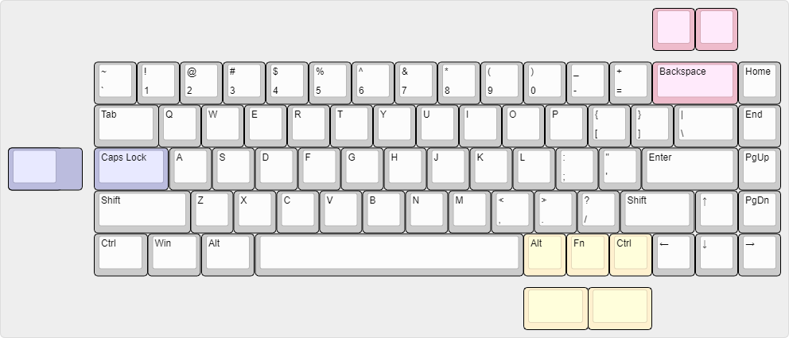

# Bakeneko 65 PCB

## Features
 * Compatible with [Unified Daughterboard](https://github.com/ai03-2725/Unified-Daughterboard)
 * QMK Firmware
 * No switch LEDs and no underglow
 * All switches are south facing
 * Designed with KiCAD 5.1.6

## Supported Layouts

## Supported Switches
 * Cherry MX and clone switches

## Case
 * [Aluminum case](https://github.com/kkatano/bakeneko-65-case)

## BOM

TBU

## Firmware

TBU

## Lisence

Bakeneko 65 PCB is released under the MIT License.
